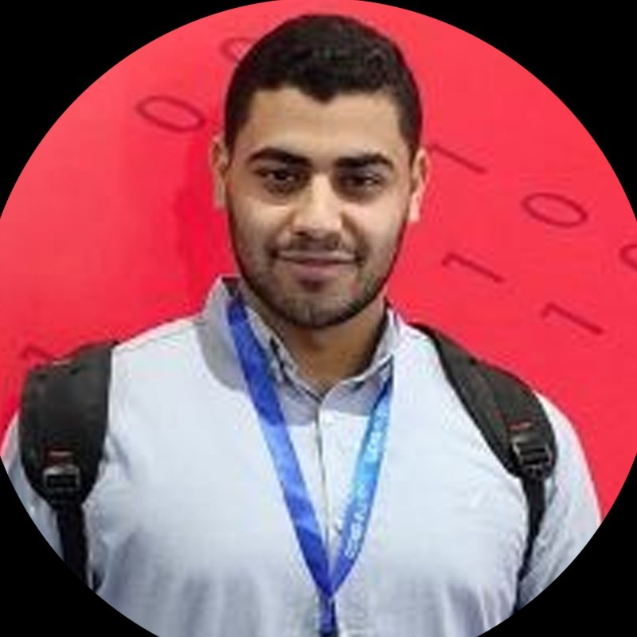

# Hi, I'm AbdulRhman AbdulGhaffar 👋

## 🚀 About Me

I am an **IT Technical Support Specialist** and **Network Engineer** with expertise in:

- **IT Technical Support**
- **Network Security**
- **System Administration**

Currently based in **Egypt**, I have a passion for designing and implementing secure and efficient IT infrastructures. My goal is to leverage my skills to create impactful solutions in the tech industry.

---

## 📜 Certifications

Here are the certifications I have achieved:

- **IT Specialist**
- **Network Security**
- **CCNA**
- **CCNP**
- **MCSE**
- **AZ-800 & AZ-801**
- **RHCSA**
- **OSCP**
- **Ejpt**
- **ECIR**
- **CyberOps Associate**
- **IT Technical Support Specialist**

---

## 🛠️ Skills

- **Networking:** Cisco, Microsoft, Linux
- **Programming:** Python
- **Security:** Ethical Hacking, CyberOps, Network Security
- **Certifications:** Cisco CCNA/CCNP, Microsoft MCSA, Red Hat RHCSA

---

## 📬 Get in Touch

---

## 🌟 Highlights

- Over **5+ years** of experience in IT and Networking.
- Successfully implemented **secure network infrastructures**.
- Actively participate in **Cybersecurity training and competitions**.

---

## 📂 Projects

### 1. **AI-Powered Cybersecurity System**
   - Developed an AI-based solution to enhance cybersecurity in critical infrastructure.

### 2. **Network Setup and Troubleshooting**
   - Designed and deployed efficient network solutions as part of the **Digital Egypt Pioneers Initiative**.

### 3. **Quranic Page Project**
   - Created a platform combining **UI/UX design** with backend development.

---

### Thank you for visiting my portfolio! 😃
