  <!-- بنر SVG متحرك -->
  

  <!-- تأثير الكتابة المتغيرة -->
   
  

<!-- Profile Picture -->

  

<h1 align="center">Hi 👋, I'm AbdulRhman AbdulGhaffar</h1>
<h3 align="center">Incident Response Analyst Trainee @DEPI | SOC Tier 1 | RHCSA | CCNA | MCSA | HCIA - Cloud Service | HCIA DataCom | IT Technical Support</h3>

---
# 📧 Contact Me

## 👤 About Me
**SOC & Incident Response Analyst** with skills in **SIEM**, log analysis, threat intelligence, and digital forensics. Seeking to apply 
expertise in threat detection, incident containment, and network security to strengthen defense mechanisms and support 
proactive cybersecurity strategies. 
## 💼 Work Experience
- **Digital Egypt Pioneers Initiative (DEPI) | Mar 2024 – Oct 2024 IT Technical Support Trainee (Scholarship)
-	Completed a 6-month intensive training program focused on IT technical support and networking.
-	Executed a capstone project on "Network Troubleshooting," simulating real-world connectivity issues.
- Applied technical skills to diagnose faults and maintain documentation as part of the practical assessment.

- **Maintenance Technician, Delta Higher Institute** (Aug 2024)
  - Participated in data center maintenance activities, ensuring optimal performance and security.

- **IT Technical Support Specialist, DEPI Egypt** (Mar 2024 – Oct 2024)
  - Completed training in IT support and freelancing skills, contributing to the "Network Troubleshooting and End-User  Support" project.

## 📚 Courses & Training
- **Incident Response Analyst Trainee, DEPI Egypt** (Jul – Dec 2025)
- **SEC504 – GCIH, Netriders Academy**
- **SEC450 – GSOC, Netriders Academy**
- **Security+ SY0-601, Netriders Academy**
- **Linux System Administrator Trainee, NTI Egypt** (Jan – Feb 2025)
- **Network Engineer Trainee, NTI Egypt** (Jan – Feb 2025)
- **DataCom Engineer Trainee, NTI Egypt**
- **Cloud Computing Engineer Trainee, NTI Egypt**
- **IT Technical Support Specialist, DEPI Egypt** ( Mar – Oct 2024 ) 
---
## 🛠️ Skills
### Technical Skills
- **SIEM Tools:** Splunk, Q Radar, Wazuh
- **Log Analysis:** Event logs & IDS/IPS alerts
- **Threat Intelligence:** MITRE ATT&CK & threat hunting
- **Scripting:** Python & Bash for automation

### Soft Skills
- Problem-solving & analytical thinking
- Teamwork & collaboration
- Effective communication
- Adaptability to new technologies
- Time management

## 🎓 Education
- **Business Information Systems, Delta University for Science and Technology** (Undergraduate)
- **Focus on IT systems, network management, and cybersecurity**. 

